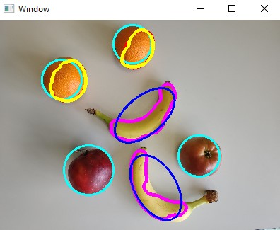

# Python script for counting and recognizing fruits - bananas, apples and oranges.
No neutral networks - just OpenCV. MARPE score ~4.2% on unknown database - works best on topdown photos(as seen below).

  

MARPE index:

  

## Project made as project on Poznan University of Technology
Repository with project description: https://github.com/PUTvision/WDPOProject

  

